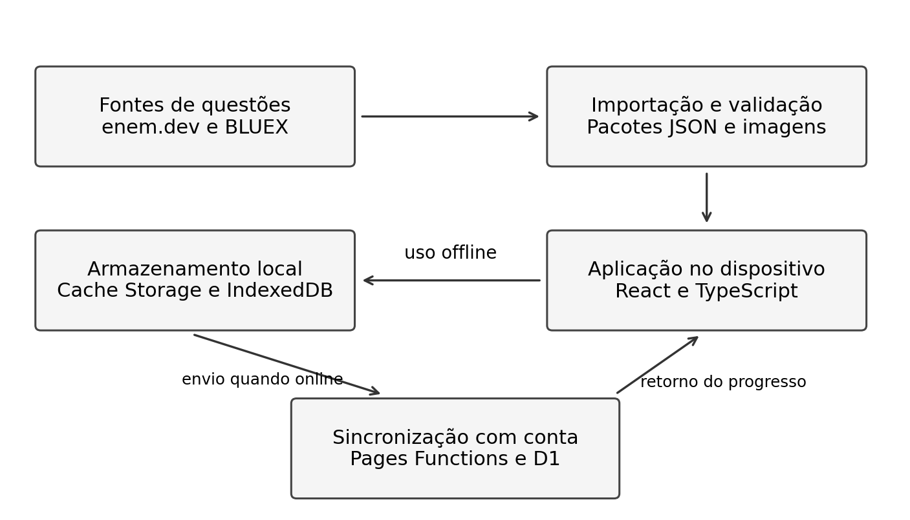
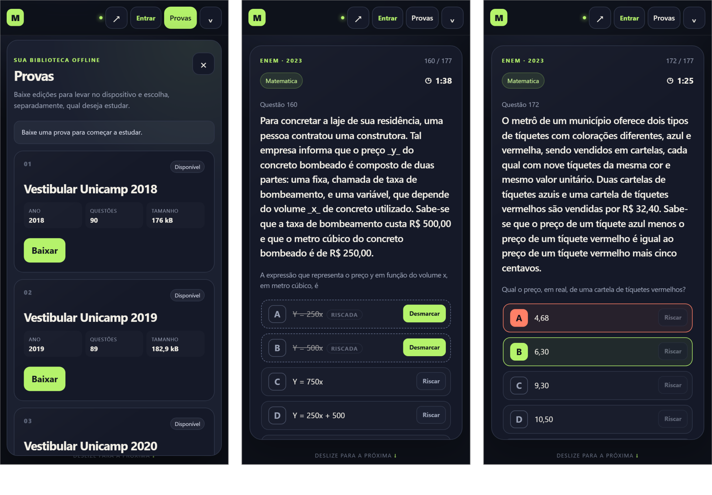
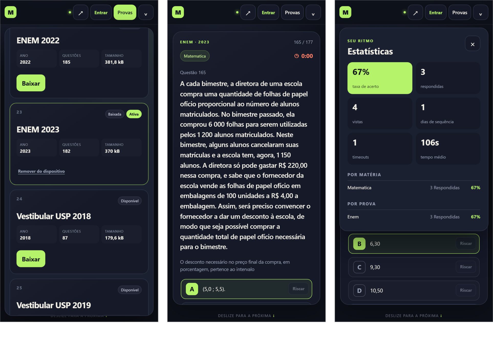

# Relatório Técnico-Científico Parcial — Maratona

> Versão em Markdown do relatório parcial. O arquivo para envio é o PDF gerado a partir de `Relatorio-Parcial-Maratona.docx`, nesta mesma pasta. As figuras e as capturas de tela originais ficam em [`relatorio-parcial/`](relatorio-parcial/).

**UNIVERSIDADE VIRTUAL DO ESTADO DE SÃO PAULO**

Paulo Vitor de Souza
RA 24217684

Erikson Souza da Silva
RA 2109840

Elias Alves Bastos Neto
RA 2225781

**Maratona como plataforma offline de questões para treino da gestão do tempo**

Campinas - SP
2026

**UNIVERSIDADE VIRTUAL DO ESTADO DE SÃO PAULO**

**Maratona como plataforma offline de questões para treino da gestão do tempo**

Relatório Técnico-Científico Parcial apresentado na disciplina de Projeto Integrador em Computação II (PJI240) da Universidade Virtual do Estado de São Paulo (UNIVESP).

Orientador: Augusto Rafael Carvalho De Sousa
Polo Campinas

Campinas - SP
2026

SOUZA, Paulo Vitor de; SILVA, Erikson Souza da; BASTOS NETO, Elias Alves. Maratona como plataforma offline de questões para treino da gestão do tempo. 20 f. Relatório Técnico-Científico Parcial. Projeto Integrador em Computação II (PJI240) - Universidade Virtual do Estado de São Paulo. Orientador: Augusto Rafael Carvalho De Sousa. Polo Campinas, 2026.

**RESUMO**

Este trabalho apresenta o desenvolvimento parcial da Maratona, uma plataforma gratuita de questões para estudantes que se preparam para o ENEM e outros vestibulares. A proposta surgiu da observação da dificuldade de um estudante em administrar o tempo de resolução, mesmo quando conhecia os conteúdos. O objetivo é oferecer prática com tempo por questão, acesso offline e acompanhamento do desempenho. A metodologia combina levantamento exploratório das necessidades da comunidade externa, pesquisa bibliográfica, prototipação e desenvolvimento incremental, seguindo as etapas de ouvir, criar e implementar. A aplicação foi construída como uma aplicação web progressiva com React e TypeScript, armazenamento local em IndexedDB e Cache Storage e estrutura de sincronização com Cloudflare Pages Functions e D1. A solução inicial permite baixar provas, responder questões com limite de três minutos, receber feedback e consultar estatísticas. Até 30 de setembro de 2026, o catálogo do repositório contém 30 pacotes e 3.994 registros de questões do ENEM, da Comvest e da Fuvest, incluindo variantes de língua estrangeira do ENEM. Há testes automatizados e recursos de acessibilidade no código, mas a validação em produção e a avaliação estruturada com estudantes ainda constituem etapas a concluir. Os resultados preliminares demonstram a construção e a ampliação da solução, sem permitir afirmar, nesta fase, melhora no desempenho em provas ou na gestão do tempo dos participantes.

**PALAVRAS-CHAVE:** Gestão do tempo; Vestibulares; Aplicação web progressiva; Estudo offline; Tecnologia educacional.

**SUMÁRIO**

**1 INTRODUÇÃO 1**

**2 DESENVOLVIMENTO 2**

2.1 Objetivos 3

2.2 Justificativa e delimitação do problema 4

2.3 Fundamentação teórica 5

2.4 Metodologia 7

2.5 Resultados preliminares: solução inicial 9

**REFERÊNCIAS 15**

# 1 INTRODUÇÃO

A preparação para o ENEM e para vestibulares envolve o domínio dos conteúdos e a organização do tempo de resolução. No contexto que motivou este projeto, Paulo Vitor de Souza observou que seu irmão conseguia resolver questões, mas encontrava dificuldade para manter um ritmo adequado durante o treino. Essa situação, discutida pelo grupo em agosto de 2026, orientou a escolha de uma ferramenta voltada à prática de questões com controle de tempo.

O plano de ação registra também conversas informais com estudantes do convívio dos integrantes, nas quais foram identificadas dificuldades relacionadas ao acesso a bancos de questões pagos e à dependência de conexão contínua. Esses relatos constituem um levantamento inicial do contexto e não uma pesquisa representativa de todos os estudantes. A proposta busca atender esse público por meio de uma aplicação gratuita que permita estudar com materiais previamente baixados.

A Maratona é uma aplicação web progressiva, ou PWA, organizada como um feed de questões. O estudante pode selecionar e baixar uma edição, responder itens de escolha única com limite de três minutos por questão e acompanhar indicadores de acerto e tempo. A arquitetura prioriza o registro local das atividades; a conta e a sincronização entre dispositivos são recursos complementares.

A pergunta que orienta o projeto é: como uma plataforma gratuita de questões, com funcionamento offline e controle do tempo de resposta, pode apoiar o treinamento da gestão do tempo e o acompanhamento dos estudos para o ENEM e vestibulares? O trabalho se concentra na construção e na avaliação inicial da ferramenta. Não tem como objetivo estimar a nota oficial do ENEM ou demonstrar, sem avaliação com usuários, ganhos de aprendizagem.

Este relatório apresenta o estágio do projeto até 30 de setembro de 2026, durante a quarta quinzena do plano de ação. São descritos os objetivos, a justificativa, os fundamentos, a metodologia e os resultados preliminares. A análise técnica considera o código e os arquivos de dados do repositório, na revisão 0179585 de 29 de setembro de 2026 (SOUZA; SILVA; BASTOS NETO, 2026b).

# 2 DESENVOLVIMENTO

O desenvolvimento parte de uma solução inicial construída pelo grupo e a amplia de acordo com o plano de ação do Projeto Integrador. O escopo reúne um banco de questões de múltiplas bancas, prática com tempo por questão e acompanhamento do desempenho. A implementação foi organizada em módulos de dados, interface, armazenamento offline e backend, com controle de versão no GitHub.

As decisões técnicas foram revistas ao longo da execução. Nas conversas iniciais, foram sugeridos Python com FastAPI e Zitadel, mas a solução presente no repositório utiliza React e TypeScript na interface, Cloudflare Pages Functions no backend e Better Auth na autenticação. O Cloudflare D1 foi mantido como banco remoto, enquanto IndexedDB e Cache Storage atendem às necessidades locais. Portanto, as tecnologias descritas neste relatório correspondem à implementação consultada, e não a todas as alternativas debatidas.

A organização das atividades combina a divisão de responsabilidades prevista no plano, discussões pelo WhatsApp e registros de tarefas e marcos no GitHub. Paulo concentra as atividades técnicas de arquitetura e implementação; Erikson participa dos levantamentos e das discussões técnicas; Elias atua na organização e na redação dos documentos. Essa divisão é uma referência de planejamento e não significa que todas as tarefas atribuídas tenham sido concluídas (SOUZA; SILVA; BASTOS NETO, 2026a).

Os resultados desta etapa são principalmente técnicos: evolução do catálogo, tratamento dos dados, recursos de estudo e estrutura de testes. A avaliação pedagógica e a validação com a comunidade externa deverão complementar esses resultados nas próximas quinzenas. Para isso, será necessário registrar as condições de uso e as devolutivas dos estudantes, relacionando os problemas observados às alterações realizadas na plataforma.

## 2.1 Objetivos

O objetivo geral é desenvolver e aprimorar a Maratona como plataforma gratuita de questões para o ENEM e vestibulares, com acesso offline, controle de tempo por questão e acompanhamento do desempenho, e avaliar sua adequação às necessidades de estudantes da comunidade externa.

Os objetivos específicos são:

• Identificar dificuldades de estudantes relacionadas à gestão do tempo e ao acesso a materiais de prática, por meio de observação e conversas com a comunidade externa.

• Organizar e ampliar o catálogo de questões, incorporando edições do ENEM e questões objetivas de outras bancas, com identificação da origem e validação dos registros.

• Implementar o download e a consulta offline das provas, preservando respostas e sessões no dispositivo.

• Oferecer treino com limite de tempo por questão, feedback da resposta e indicadores de desempenho por prova e matéria.

• Estruturar a autenticação opcional e a sincronização de progresso entre dispositivos, com tratamento de falhas de conexão e de eventos repetidos.

• Verificar os fluxos principais por testes automatizados e revisão de acessibilidade e coletar sugestões de estudantes para orientar os ajustes da solução.

A gamificação será desenvolvida de forma gradual. Nesta fase, a aplicação já apresenta sequência de dias estudados e feedback de desempenho. Ranking, competição e repetição espaçada permanecem como possibilidades de evolução, condicionadas ao tempo disponível e à avaliação da utilidade para o público do projeto.

## 2.2 Justificativa e delimitação do problema

A justificativa prática decorre de uma necessidade observada no convívio do grupo: acertar questões isoladas não garante que o estudante consiga administrar o tempo de uma prova extensa. Uma ferramenta que registre o tempo de resposta e mostre o desempenho pode fornecer informações para que ele reconheça dificuldades e ajuste sua rotina de treino. O limite de três minutos adotado na versão inicial é uma configuração do produto, derivada do tempo médio disponível por questão no ENEM (seção 2.3), e não uma regra oficial comum a todas as bancas.

A possibilidade de baixar uma prova e utilizá-la sem conexão também atende à necessidade de continuidade do estudo em ambientes com internet instável. O acesso offline depende de um primeiro acesso com conexão e da instalação dos pacotes no dispositivo. A gratuidade pretendida refere-se ao acesso do estudante; a manutenção da infraestrutura e a disponibilidade das fontes de dados devem ser acompanhadas pelo grupo.

O público inicial é formado por estudantes em preparação para o ENEM e vestibulares, acessíveis por meio de familiares e colegas dos integrantes. O contexto permite uma avaliação exploratória da solução com pessoas que enfrentam o problema investigado. Não houve, nesta etapa, levantamento estatístico que permita generalizar a frequência das dificuldades de tempo ou de conectividade para outras populações.

O recorte funcional abrange questões objetivas de escolha única, de edições anteriores do ENEM, da primeira fase da Comvest e da primeira fase da Fuvest presentes no catálogo. A plataforma não substitui aulas, materiais explicativos ou orientação pedagógica. Também não reproduz integralmente as condições de uma prova oficial: o treino por questão e a navegação pelo feed diferem de uma sessão completa de exame.

A relevância acadêmica está na integração entre desenvolvimento web, banco de dados, APIs, infraestrutura em nuvem, acessibilidade, controle de versão e testes. A contribuição esperada para a comunidade é uma ferramenta de prática de fácil acesso, cuja utilidade deverá ser verificada por observação de uso e devolutivas. O problema de pesquisa permanece centrado no apoio ao treino e ao acompanhamento dos estudos, sem antecipar conclusões sobre eficácia educacional.

## 2.3 Fundamentação teórica

A proposta associa o treino à prática com questões e à observação do desempenho. Estudos de psicologia cognitiva indicam que responder questões, em vez de apenas reler o conteúdo, favorece a retenção de longo prazo, fenômeno conhecido como efeito de testagem (ROEDIGER; KARPICKE, 2006). Em uma revisão de dez técnicas de estudo, Dunlosky et al. (2013) classificaram a prática com testes entre as de maior utilidade, com resultados consistentes para diferentes idades, conteúdos e formatos de avaliação. Esses resultados sustentam a escolha de um feed de questões como atividade central da Maratona. Os indicadores de acerto e tempo, por sua vez, oferecem informações para a reflexão do estudante, mas não comprovam aprendizagem ou preparação para uma prova.

No ENEM, cada dia de aplicação reúne 90 questões objetivas. No segundo dia, dedicado a Ciências da Natureza e Matemática, a duração é de 5 horas, o que corresponde a cerca de 3 minutos e 20 segundos por questão; no primeiro dia, as 5 horas e 30 minutos incluem também a redação (INEP, 2023). O limite de três minutos adotado na Maratona aproxima-se dessa média e reserva uma margem para revisão e preenchimento do cartão-resposta. Trata-se de uma referência de treino: na prova, as questões variam em extensão e dificuldade, e o estudante distribui o tempo livremente.

A gamificação incorpora elementos de jogos a atividades de aprendizagem. Sailer e Homner (2020) identificaram efeitos positivos, com variação entre estudos e menor estabilidade de parte dos resultados. Essa evidência fundamenta a exploração gradual de feedback e sequência de estudo na Maratona. A utilidade desses recursos deverá ser avaliada com os estudantes, sem presumir ganhos automáticos.

Em uma PWA, service workers podem tratar requisições e utilizar cache para disponibilizar recursos previamente armazenados quando a rede está indisponível (MDN WEB DOCS, s.d.). Na Maratona, o Cache Storage conserva pacotes e imagens e o IndexedDB registra metadados, progresso, sessões e eventos pendentes.

O Cloudflare D1 é um banco gerenciado com semântica SQL baseada em SQLite e integração com aplicações Workers e Pages (CLOUDFLARE, 2026). Sua escolha permite reunir backend e banco remoto no ambiente Cloudflare. Na arquitetura do projeto, ele atende à identificação de usuários e à consolidação do progresso, enquanto o registro inicial do estudo ocorre no dispositivo.

O Better Auth oferece autenticação e gerenciamento de contas e sessões para TypeScript (BETTER AUTH, s.d.). No projeto, está configurado para e-mail e senha e login com Google, com mensagens de verificação e recuperação por Resend.

As WCAG 2.2 tratam da operação por teclado, da identificação de controles, do foco e dos limites de tempo (W3C, 2024). A Maratona contém nomes acessíveis, gerenciamento de foco e testes com Axe. Será necessário avaliar as descrições das imagens e alternativas de tempo quando aplicáveis. Testes automáticos não comprovam conformidade integral.

## 2.4 Metodologia

O trabalho adota uma abordagem aplicada e exploratória, voltada à construção de uma solução para um problema observado. O desenvolvimento é incremental e segue as etapas de ouvir e interpretar o contexto, criar e prototipar, e implementar e testar, previstas no modelo da UNIVESP. O plano de ação organiza a execução em sete quinzenas, de 10 de agosto a 15 de novembro de 2026 (SOUZA; SILVA; BASTOS NETO, 2026a).

Na etapa de ouvir, o ponto de partida foi a observação de Paulo sobre a dificuldade de seu irmão em gerir o tempo nas questões. O plano registra conversas informais com estudantes próximos ao grupo sobre tempo e acesso a bancos de questões. Essas informações orientaram o problema inicial. Como não há um instrumento estruturado nem uma quantidade de participantes registrada, essa etapa é tratada como levantamento exploratório, sem apresentação de percentuais ou resultados de questionários.

Na etapa de criar, o grupo discutiu o escopo pelo WhatsApp e adotou o feed de questões com limite de tempo e progresso local. Em 23 de agosto, foi comunicado o desenvolvimento de um MVP com React, armazenamento local e backend Cloudflare. Em 11 de setembro, foi registrada a inclusão de questões da Comvest e da Fuvest provenientes do dataset BLUEX, disponibilizado no Hugging Face (PORTUGUESE BENCHMARK DATASETS, s.d.), além da organização de tarefas em épicos e marcos no GitHub.

O tratamento dos dados utiliza importadores para a API pública do projeto enem.dev (ENEM.DEV, s.d.) e para o dataset BLUEX, que reúne questões de primeira fase da Unicamp e da USP (ALMEIDA et al., 2023). A API enem.dev é uma fonte de terceiros, e não uma API oficial do INEP. Os registros são normalizados para um contrato comum, com identificadores de banca, edição, matéria, alternativas e gabarito. São mantidos relatórios de importação, rejeições e lacunas; dados incompletos não são preenchidos por suposição. A integridade dos pacotes é conferida por tamanho e hash SHA-256.

Na etapa de implementar, a interface é desenvolvida em React e TypeScript, com Vite como ferramenta de desenvolvimento e build. A aplicação registra as interações no dispositivo e mantém uma fila para sincronização. O backend identifica o usuário pela sessão e trata eventos com identificadores próprios, para evitar contagem repetida durante reenvios. O uso sem conta permanece disponível, enquanto a sincronização remota depende de autenticação e conexão.

A estratégia de testes inclui Vitest para unidades e integrações e Playwright para jornadas em navegador. Os arquivos de teste contemplam importação e contratos, download e remoção de pacotes, persistência do progresso, limite de tempo e sincronização. Os testes de navegador utilizam serviços simulados nos limites de autenticação e sincronização; portanto, precisam ser complementados por testes reais de Google OAuth, Resend e D1 antes da disponibilização pública.

A próxima avaliação com estudantes deverá observar o fluxo de escolha e download de prova, resolução de questões, uso offline e consulta de estatísticas. Pretende-se registrar data, perfil geral do participante, dispositivo utilizado, dificuldades encontradas e sugestões, sem divulgar dados pessoais desnecessários. As devolutivas serão organizadas por tema e relacionadas às alterações propostas. A comparação de indicadores de tempo e acerto, se realizada, será descritiva e não permitirá atribuir causalmente uma melhora à plataforma.

O acompanhamento do projeto utiliza o plano de ação, os registros de tarefas e o histórico de versões. Nas quinzenas seguintes estão previstos ajustes com base nas devolutivas, testes finais, análise dos resultados e produção do vídeo e do relatório final. A prioridade é consolidar o funcionamento do escopo existente antes de ampliar recursos de competição ou adicionar novas bancas.

## 2.5 Resultados preliminares: solução inicial

Na etapa de ouvir, o resultado inicial foi a delimitação de dois aspectos do problema: treino da gestão do tempo e acesso contínuo a questões. Na etapa de criar, foi definida uma solução com navegação por feed, limite de três minutos e possibilidade de estudo offline. Na etapa de implementar, o repositório apresenta a aplicação, os importadores, o catálogo de dados, o backend e as suítes de teste. A avaliação estruturada da versão evoluída com estudantes ainda deverá ser concluída.

A Figura 1 apresenta a organização da solução. As fontes alimentam os importadores; os pacotes validados são disponibilizados à aplicação; o dispositivo mantém o conteúdo e o progresso; e a sincronização com conta conecta os registros locais ao backend.

Figura 1 - Organização da arquitetura da Maratona

Fonte: Elaborado pelo grupo com base no código do projeto (2026).

O catálogo foi conferido diretamente no manifesto e nos pacotes JSON da revisão consultada. A Tabela 1 apresenta os registros disponíveis no repositório.

Tabela 1 - Pacotes e registros de questões no repositório em 30 de setembro de 2026

| **Banca** | **Período** | **Pacotes** | **Registros** |
| --- | --- | --- | --- |
| ENEM | 2009 a 2023 | 15 | 2.748 |
| Comvest / Unicamp | 2018 a 2024 | 8 | 626 |
| Fuvest / USP | 2018 a 2024 | 7 | 620 |
| Total | 2009 a 2024 | 30 | 3.994 |

Fonte: Manifesto e pacotes do repositório Maratona, revisão 0179585 (2026).

O total do ENEM inclui registros distintos para variantes de língua estrangeira disponíveis na fonte. Assim, os 3.994 registros não equivalem a 3.994 posições únicas de provas completas. A Comvest 2021 possui dois pacotes, um para cada dia, o que explica a presença de oito pacotes no intervalo de sete anos. Algumas questões foram excluídas por ausência de gabarito ou conteúdo incompatível com o contrato atual, conforme os relatórios de importação.

No fluxo de estudo, a aplicação permite selecionar uma edição, baixar o conteúdo e escolher o idioma estrangeiro quando aplicável (Figura 2a). O feed apresenta o enunciado, as alternativas e o cronômetro. A resposta ou o término do tempo bloqueia as alternativas e apresenta feedback (Figura 2c). Nas alterações de setembro, foram incorporadas a pausa do timer ao sair da questão visível e a possibilidade de riscar alternativas durante a leitura, preservando o rascunho local (Figura 2b).

Figura 2 - Fluxo de estudo: (a) catálogo de provas; (b) questão com cronômetro e alternativas riscadas; (c) feedback após resposta incorreta

Fonte: Capturas de tela da aplicação na revisão 0179585 (2026).

As estatísticas incluem questões vistas e respondidas, taxa de acerto, esgotamentos de tempo, tempo médio e sequência de dias estudados, com agrupamentos por matéria e prova (Figura 3c). Esses recursos já permitem apresentar informações da prática. A Figura 3 também mostra uma edição baixada e ativa no dispositivo e o bloqueio de uma questão ao fim dos três minutos. Os números do painel correspondem a uma sessão de demonstração do grupo, com quatro questões, e não a dados de estudantes.

Figura 3 - Uso offline, tempo e desempenho: (a) edição baixada e ativa; (b) questão bloqueada por tempo esgotado; (c) painel de estatísticas

Fonte: Capturas de tela da aplicação na revisão 0179585 (2026).

A Tabela 2 distingue essa implementação de entregas que ainda exigem validação ou desenvolvimento.

Tabela 2 - Situação dos principais recursos no estágio parcial

| **Recurso** | **Situação no estágio parcial** |
| --- | --- |
| Catálogo de múltiplas bancas | Pacotes do ENEM, Comvest e Fuvest presentes no repositório. |
| Download e progresso offline | Implementação local e testes de persistência, integridade e remoção. |
| Timer, respostas e rascunho | Código para limite de três minutos, pausa ao sair da questão e alternativas riscadas. |
| Estatísticas e sequência de estudo | Painel implementado; eficácia para orientar o estudo ainda a avaliar. |
| Conta e sincronização | Better Auth e backend implementados; serviços externos exigem validação em produção. |
| Ranking e repetição espaçada | Possibilidades de evolução; não apresentados como recursos concluídos. |
| Avaliação com estudantes | Levantamento informal inicial; avaliação estruturada da versão evoluída pendente. |

Fonte: Elaborado pelo grupo com base no plano e no repositório (2026).

A verificação técnica foi repetida na revisão consultada (0179585), em 30 de setembro de 2026. Os 203 testes de unidade e integração, distribuídos em 26 arquivos, foram aprovados; na primeira revisão de qualidade, em 23 de agosto, a suíte tinha 52 testes em 15 arquivos. A suíte de navegador, executada com Playwright, cobre seis cenários: catálogo e acessibilidade, resposta por teclado, limite de três minutos, download e uso offline, jornada com múltiplas edições e sincronização entre dispositivos. A documentação de testes também explicita o uso de serviços simulados e a necessidade de verificação real da infraestrutura externa (SOUZA; SILVA; BASTOS NETO, 2026b).

Os avanços confirmam a existência de uma solução inicial e sua ampliação para múltiplas bancas. Permanecem como próximos passos a revisão editorial dos dados e das atribuições, a validação do deploy e dos serviços externos, a avaliação de acessibilidade e a coleta de devolutivas dos estudantes. A documentação de proveniência aponta pendências de revisão dos direitos e das obras incorporadas às questões antes de uso público amplo. Nesta fase, não há resultados suficientes para afirmar melhora no desempenho dos participantes ou eficácia do treino de tempo.

# REFERÊNCIAS

ALMEIDA, Thales Sales; LAITZ, Thiago; BONÁS, Giovana K.; NOGUEIRA, Rodrigo. BLUEX: a benchmark based on Brazilian Leading Universities Entrance eXams. **arXiv**, 2023. arXiv:2307.05410. Disponível em: https://arxiv.org/abs/2307.05410. Acesso em: 30 set. 2026.

BETTER AUTH. **Introduction**. [S.l.], [s.d.]. Disponível em: https://better-auth.com/docs/introduction. Acesso em: 30 set. 2026.

CLOUDFLARE. **Cloudflare D1**. [S.l.], 2026. Disponível em: https://developers.cloudflare.com/d1/. Acesso em: 30 set. 2026.

DUNLOSKY, John; RAWSON, Katherine A.; MARSH, Elizabeth J.; NATHAN, Mitchell J.; WILLINGHAM, Daniel T. Improving students’ learning with effective learning techniques: promising directions from cognitive and educational psychology. **Psychological Science in the Public Interest**, v. 14, n. 1, p. 4-58, 2013. DOI: 10.1177/1529100612453266.

ENEM.DEV. **API enem.dev**. [S.l.], [s.d.]. Disponível em: https://enem.dev. Acesso em: 30 set. 2026.

INEP – INSTITUTO NACIONAL DE ESTUDOS E PESQUISAS EDUCACIONAIS ANÍSIO TEIXEIRA. Edital nº 30, de 5 de maio de 2023. **Exame Nacional do Ensino Médio (Enem) 2023**. Brasília, DF: Inep, 2023. Disponível em: https://download.inep.gov.br/enem/edital_2023_leitor_de_tela.txt. Acesso em: 30 set. 2026.

MDN WEB DOCS. **Offline and background operation**. [S.l.], [s.d.]. Disponível em: https://developer.mozilla.org/en-US/docs/Web/Progressive_web_apps/Guides/Offline_and_background_operation. Acesso em: 30 set. 2026.

PORTUGUESE BENCHMARK DATASETS. **BLUEX**. Hugging Face, [s.d.]. Disponível em: https://huggingface.co/datasets/portuguese-benchmark-datasets/BLUEX. Acesso em: 30 set. 2026.

ROEDIGER, Henry L.; KARPICKE, Jeffrey D. Test-enhanced learning: taking memory tests improves long-term retention. **Psychological Science**, v. 17, n. 3, p. 249-255, 2006. DOI: 10.1111/j.1467-9280.2006.01693.x.

SAILER, Michael; HOMNER, Lisa. The gamification of learning: a meta-analysis. **Educational Psychology Review**, v. 32, p. 77-112, 2020. DOI: 10.1007/s10648-019-09498-w. Disponível em: https://link.springer.com/article/10.1007/s10648-019-09498-w. Acesso em: 30 set. 2026.

SOUZA, Paulo Vitor de; SILVA, Erikson Souza da; BASTOS NETO, Elias Alves. **Plano de ação**: Projeto Integrador 2 - PJI240. Campinas, 2026a. Documento de planejamento do grupo.

SOUZA, Paulo Vitor de; SILVA, Erikson Souza da; BASTOS NETO, Elias Alves. **Maratona**: plataforma offline de questões. Repositório de código e documentação. 2026b. Revisão consultada: 0179585c780a1ba7ffc4c6884ef5e9d3b86aabd1, de 29 set. 2026. Disponível em: https://github.com/paulop2/projeto-integrador-PJI240. Acesso em: 30 set. 2026.

W3C. **Web Content Accessibility Guidelines (WCAG) 2.2**. W3C Recommendation, 12 dez. 2024. Disponível em: https://www.w3.org/TR/WCAG22/. Acesso em: 30 set. 2026.
